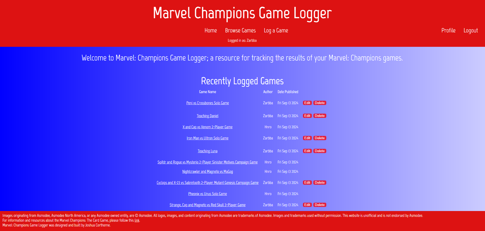

# Marvel: Champions Game Logger

## Rationale
I'm an avid gamer including both digital and analogue games. In the last six months I've been playing a lot of Fantasy Flight Game's excellent Marvel Comic's based game, Marvel Champions. I mostly play this game with my friend henry and while there are a lot of great fan resources on the web for doing things like card lookups or deckbuilding, we don't have a great way to keep track of our games. This becomes especially bothersome when playing campaign games as there are multiple pieces of information that need to be tracked and you might not play the next game in the campaign for weeks or even months. This lead me to design this web page. Marvel Champions Game Logger is designed to bridge that gap offerring users the ability to create game and campaign logs to keep track of everything that goes on in their games of Marvel Champions.

## Current Functionality
At this stage of development, campaign logging is not yet implemented. Features currently available are basic user accounts (login, logout, signup and password change) as well as the core game logging functionality. Any guest or user can view previously logged games but only the original creators may make edits or delete logs. Creating new logs is also limited to signed in users.
  At present the following fields are available for game logs:
* Name
* Date played
* Scenario played
* Player name*
* Player hero*
* Game outcome(win/loss)
* Notes

\* Games are limited to 4 players in line with Marvel Champions game rules.

## Getting Started
You can find the publicly accessible version of Marvel Champions Game Logger [here](https://mcgl.onrender.com/). Please be aware that if traffic is low the site may require up to 50 seconds to spin up from an inactive state.

## Attributions
For more information regarding Marvel Champions: The Card Game please visit the [official website](https://www.fantasyflightgames.com/en/products/marvel-champions-the-card-game/)

## Technologies
[HTML and CSS](https://www.w3schools.com/), [javacript](https://developer.mozilla.org/en-US/), [node](https://nodejs.org/docs/latest/api/), [bcrypt](https://www.npmjs.com/package/bcrypt), [express](https://expressjs.com/), [method-override](https://www.npmjs.com/package/method-override), [morgan](https://www.npmjs.com/package/morgan), [mongoDB](https://www.mongodb.com/docs/), [connect-mongo](https://www.npmjs.com/package/connect-mongo), [mongoose](https://mongoosejs.com/docs/).

## Future Enhancments

### Game Logs
* Game modes including both standard/expert and heroic mode
* Game state tracking such as remaining hitpoints at end game

### Campaign Logs
* Tracking of campaigns and the capacity to assign games to campaigns
* Dynamic log fields for various campaign types e.g. Sinister Motives
* Tracking of campaign progess by assign games to specific campaign scenarios
* Interactive campaign trackers for each campaign to assist with game setup
### User Profile and Features
* Password recovery
* Notifications
* Invite users to share ownership or collaborate on game and campaign logs
* View all campaign and game logs associated with a specific user/player
* Claim players in games and campaigns
### General UI and Code Refactoring
* Implement search functionality for logs and users
* Improve design to be more readable on smaller devices
* Move pagination and utility from JS logic to mongoDB for efficiency
* Make delete confirmation a modal instead of a full page

